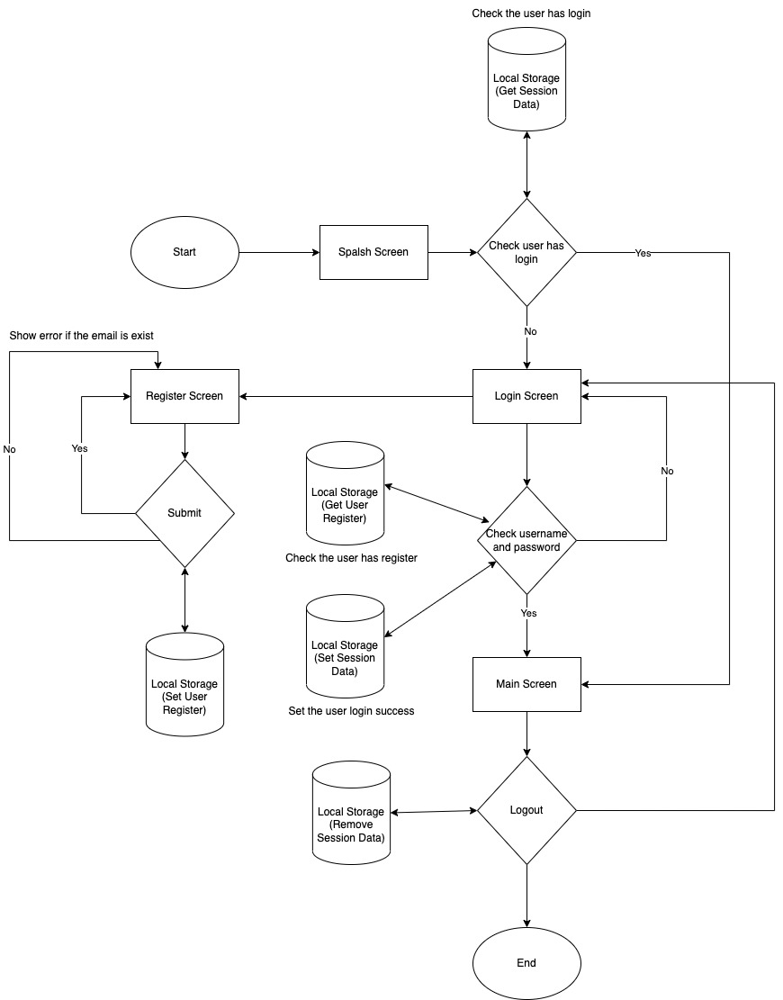

# Surplus-Task

Made with React Native

Tech Features:
1. React Native 0.71.8
2. Typescript 4.8.4
3. React Navigation 
4. React Native Vector Icons
5. React Native Snap Carousel
6. react-hook-form
7. React Native AsyncStorage
8. React Native Fast Image
9. React Native Webview
8. Stein JS Client

## Hooks and APIs Implementation
<input type="checkbox" disabled checked /> useCallback<br>
<input type="checkbox" disabled checked /> useContext<br>
<input type="checkbox" disabled checked /> useEffect<br>
<input type="checkbox" disabled checked /> useRef<br>
<input type="checkbox" disabled checked /> useState<br>
<input type="checkbox" disabled checked /> memo<br>
<input type="checkbox" disabled checked /> createContext<br>

## Setup Environment
First, setup your environment by following this guide on https://reactnative.dev/docs/environment-setup

## Clone Project
```
git clone
cd 
npm install
```

## Structure

```
App
├── assets
│   ├── icon
│   └── image
├── context
├── helper
│   ├── string
|   ├── pattern
│   └── navigation
├── hook
├── navigation
├── screens
│   ├── Account
│   ├── Auth
│   └── Home
│   └── MainScreen
│   └── Splash
│   └── WebView
├── theme
├── storage
├── uikit
│   └── Button
│   └── Divider
│   └── Header
│   └── Icon
│   └── Spinner
│   └── Text
│   └── TextInput
```

## Testing
We have two kind of test: unit test and snapshot test.
For unit test and snapshot, we will use `jest` with react native.

Every unit test must be placed under corresponding feature you want to add test and create `__test__` folder.
Every component should have snapshot test.

if you want to running unit testing, you can run this command `npm run test`

### List Testing Coverage
| Type Testing | Location FIle |
| ----------------------- | ----------------------------------- |
| Snapshoot Test | App/uikit/* and App/screens/Splash |
| Function Test | App/helper/string |


## Icon & Image
We use icomoon for converting svg icon into `.ttf` so you don't need to use png file for icon.
Icomoon can be accessed here: https://icomoon.io/

## Surplus Flow Chart


## Video Demo
Look vidoe demo this link https://www.awesomescreenshot.com/video/17917316?key=efad9ff2a8d1b344e690220b6e742f01
